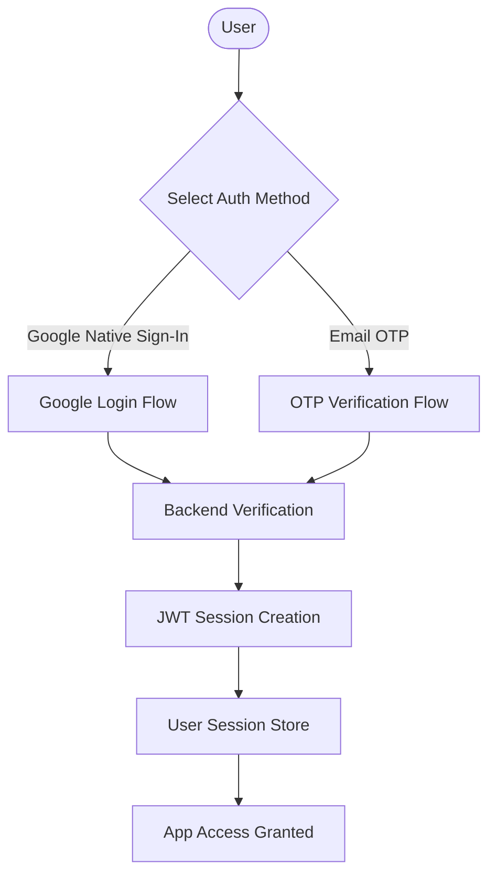
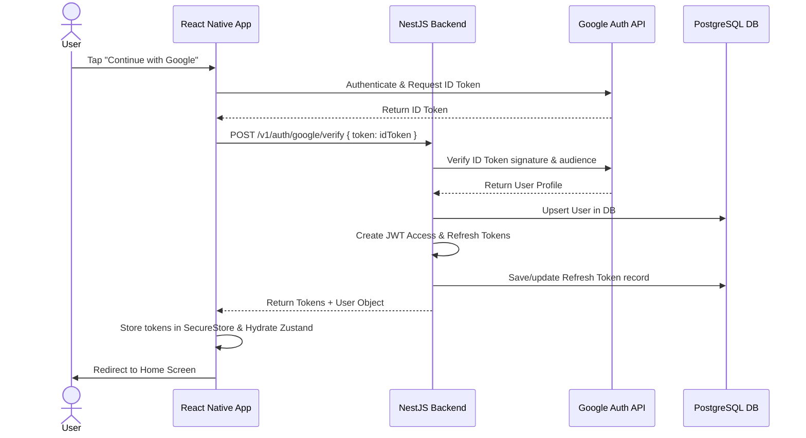
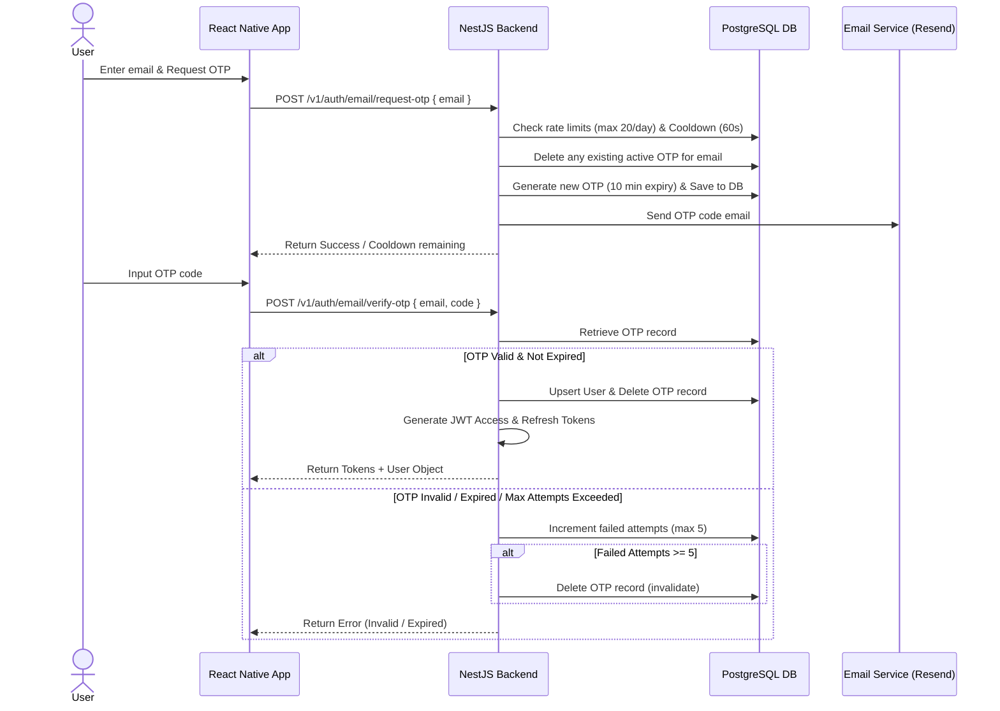
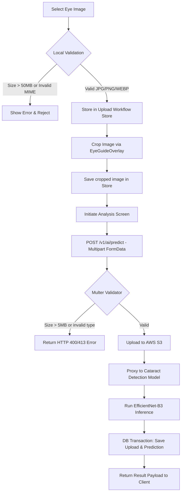

# SpandaVidya — AI-Powered Ayurvedic Healthcare Platform

SpandaVidya is a production-grade AI healthcare application that combines Ayurvedic consultation (chat) with cataract detection via computer vision. Users interact through a React Native mobile app; all AI, ML, and data operations are handled exclusively by the NestJS backend — never client-side.

**Architecture at a glance:**

```
React Native (Expo) → NestJS Backend Gateway → 1. Eye Detection Model (Cloud Run)
                                             → 2. Cataract Detection Model (Cloud Run)
                                             → 3. Google Gemini 2.5 Flash (SSE Streaming)
                                             → AWS S3 (file storage)
                                             → PostgreSQL via Prisma (persistence)
```

## Table of Contents

1. [Tech Stack](#tech-stack)
2. [Folder Structure](#folder-structure)
3. [Environment Variables](#environment-variables)
4. [Authentication Architecture](#authentication-architecture)
5. [API & System Design](#api--system-design)
6. [File Upload Architecture](#file-upload-architecture)
7. [Cataract ML Service](#cataract-ml-service)
8. [Image Prediction Flow](#image-prediction-flow)
9. [Streaming (SSE)](#streaming-sse)
10. [Backend Modules](#backend-modules)
11. [Database & Prisma](#database--prisma)
12. [Docker Setup](#docker-setup)
13. [CI/CD](#cicd)
14. [Security](#security)
15. [Testing Architecture](#testing-architecture)

---

## Tech Stack

### Backend

| Layer        | Technology                              |
| ------------ | --------------------------------------- |
| Framework    | NestJS (TypeScript)                     |
| ORM          | Prisma                                  |
| Database     | PostgreSQL                              |
| Auth         | JWT (access + refresh) + Google OAuth   |
| AI Chat      | Google Gemini 2.5 Flash (SSE streaming) |
| ML Inference | Google Cloud Run (EfficientNet-B3)    |
| File Storage | AWS S3 (presigned URLs)                 |
| Monitoring   | Prometheus + Sentry                     |
| Security     | Helmet, CORS, Rate-Limit, HPP           |
| Logging      | nestjs-pino (JSON structured)           |
| Testing      | Jest + Supertest                        |

### Frontend

| Layer        | Technology                                |
| ------------ | ----------------------------------------- |
| Framework    | Expo SDK 54 + React Native 0.81           |
| Language     | TypeScript                                |
| Navigation   | Expo Router                               |
| Styling      | NativeWind (Tailwind CSS)                 |
| State        | Zustand                                   |
| Server State | TanStack React Query                      |
| HTTP         | Axios                                     |
| Forms        | React Hook Form + Zod                     |
| Lists        | FlashList                                 |
| Animation    | React Native Reanimated                   |
| UI Extras    | Gorhom Bottom Sheet                       |
| Auth         | @react-native-google-signin/google-signin |

---


**Key frontend files:**

| Area          | Path                                                 |
| ------------- | ---------------------------------------------------- |
| Auth API      | `src/features/auth/api/auth-api.ts`                  |
| Session store | `src/features/auth/store/session-store.ts`           |
| Token storage | `src/shared/auth/token-storage.ts`                   |
| HTTP client   | `src/shared/api/http-client.ts`                      |
| Query client  | `src/shared/api/query-client.ts`                     |
| Chat API      | `src/features/chat/api/chat-api.ts`                  |
| Stream parser | `src/features/chat/streaming/parse-stream-chunks.ts` |

---

## Environment Variables

### Backend (`.env`)

```env
NODE_ENV=development
PORT=8080

# Database
DATABASE_URL="postgresql://postgres:@db.<ref>.supabase.co:5432/postgres"
DIRECT_URL="postgresql://postgres:@db.<ref>.supabase.co:5432/postgres"

# sendotp
RESEND_API_KEY=abc

# JWT
JWT_SECRET=<secret>
JWT_EXPIRES_IN=60m
JWT_REFRESH_SECRET=<refresh-secret>
JWT_REFRESH_EXPIRES_IN=7d

# PostgreSQL (Docker)
POSTGRES_USER=postgres
POSTGRES_PASSWORD=postgres
POSTGRES_DB=spandavidya

# ML Gateway Microservices (Google Cloud Run)
EYE_DETECTION_MODEL_API_URL=https://eye-detection-service-235799044931.asia-south1.run.app/detect-eye/
CATARACT_MODEL_API_URL=https://cataract-detection-235799044931.asia-south1.run.app/predict
ML_GATEWAY_TIMEOUT_MS=60000
ML_GATEWAY_MAX_RETRIES=0

# Google Gemini
GOOGLE_API_KEY=<key>
GOOGLE_GEMINI_MODEL=gemini-2.5-flash

# AWS S3
AWS_ACCESS_KEY_ID=<key>
AWS_SECRET_ACCESS_KEY=<secret>
AWS_REGION=ap-south-1
AWS_S3_BUCKET_NAME=<bucket>

# Google OAuth
GOOGLE_WEB_CLIENT_ID=<id>
GOOGLE_ANDROID_CLIENT_ID=<id>
GOOGLE_IOS_CLIENT_ID=<id>
```

### Frontend (`.env`)

```env
EXPO_PUBLIC_API_URL=http://localhost:8080/v1
EXPO_PUBLIC_GOOGLE_WEB_CLIENT_ID=<id>
EXPO_PUBLIC_GOOGLE_IOS_CLIENT_ID=<id>
EXPO_PUBLIC_GOOGLE_ANDROID_CLIENT_ID=<id>
```

---

## Authentication Architecture

**Strategy:** JWT access + refresh token rotation, backed by Google Native Sign-In.

Mobile (primary) and web flows are isolated.

### Authentication Flow Diagram



### Google Login Flow Diagram



### OTP Verification Flow Diagram




**Refresh token rotation:** On every refresh, the old token is invalidated and a new pair is issued. Tokens are stored server-side (DB) to support revocation.

**Email OTP Flow:**
OTPs are requested via `POST /v1/auth/email/request-otp` and verified via `POST /v1/auth/email/verify-otp`.
* **Rate limit:** Max 20 OTP requests per email per day.
* **Cooldown:** Enforces 60-second wait between requests.
* **Attempt limits:** Max 5 failed verification attempts before the OTP is deleted.
* **Expiry:** OTPs expire and are invalidated after 10 minutes.
* **Auditing:** Logs events such as `OTP_REQUESTED`, `USER_REGISTERED`, and `USER_LOGGED_IN` to the audit log.

**Decorators:** `@Public()` opts routes out of the JWT guard. `@Roles()` enforces RBAC.

---

## API & System Design

- **Versioning:** URI-based (`/v1/...`) via `app.enableVersioning({ type: VersioningType.URI })`.
- **Validation:** Global `ValidationPipe` with `whitelist: true`, `forbidNonWhitelisted: true`.
- **Logging:** `nestjs-pino` — zero-allocation JSON, correlation IDs, Datadog/CloudWatch compatible.
- **Rate limiting:** `@nestjs/throttler` backed by Redis. Strict limits on `/ai/generate` to prevent billing attacks.
- **Error handling:** Machine-Readable Error Contract v1.0 (unified 8-field JSON responses, `ApiErrorCode`, `ErrorCategory`).
- **Audit logging:** Tracks user actions, metadata, and diffs on sensitive operations.

### Error Handling Architecture (Error Contract v1.0)

All HTTP non-2xx and database exception outputs across the API gateway conform strictly to **Machine-Readable Error Contract v1.0**:

```json
{
  "statusCode": 400,
  "errorCode": "EYE_NOT_DETECTED",
  "category": "IMAGE",
  "message": "Uploaded image does not contain a recognizable human eye.",
  "error": "Bad Request",
  "requestId": "req_f812a3b04c9e",
  "timestamp": "2026-08-06T12:00:00.000Z",
  "contractVersion": "1.0"
}
```

- **Centralized Serializer (`buildClientErrorBody`):** Enforces 100% field structure parity across all filter outputs.
- **Unified Filters (`HttpExceptionFilter` & `PrismaExceptionFilter`):** Intercept standard NestJS and Prisma exceptions (`P1000`, `P1001`, `P2002`, `P2025`), scrubbing 500 server error messages to `"Internal server error"` and redacting sensitive payload data.
- **Client Error Parser (`error-parser.ts`):** `MACHINE_ERROR_MAP` exhaustively translates all 24 `ApiErrorCode` values directly into client workflow states.

---

## File Upload Architecture

The application handles file uploads through two distinct mechanisms depending on the file type:

1. **General/Asset Uploads:** The client requests a presigned S3 URL from the NestJS backend, and then uploads the file directly to S3.
2. **AI Eye Scan Prediction Images:** The client performs a direct multipart `FormData` upload to the NestJS backend via `POST /v1/ai/predict`. The backend validates the image (size, type, dimensions), uploads the buffer directly to S3, and forwards it to the Cataract Detection Model.

### Frontend Steps (AI Eye Scan)
1. **Select Image** – User picks an eye image via the device camera or library.
2. **Validation** – Client‑side MIME (JPG, JPEG, PNG, WEBP) and size (≤ 50 MB) checks; invalid files are rejected locally.
3. **Crop UI** – Interactive crop overlay allows the user to scale and position the eye within a guided circle.
4. **Confirm Crop** – Cropped image is saved in the **upload‑workflow store** (Zustand).
5. **Upload Another (optional)** – Users can clear the workflow and restart.
6. **Upload & ML Processing** – The client sends the image as a multipart `FormData` payload directly to the NestJS backend using `POST /v1/ai/predict` (reusing the current chat context `chatId` if origin is Chat).

### Backend Processing
1. **Multer Interceptor** – Receives the multipart file and validates MIME (JPG, JPEG, PNG, WEBP) and size (≤ 5 MB limit).
2. **Dimension Validator** – Checks image dimensions to ensure they do not exceed 4096 × 4096 px.
3. **S3 Service** – Backend uploads the validated image buffer directly to AWS S3.
4. **ML Inference Gateway** – Proxies the image buffer to the Cataract Detection Model with timeout and retry logic.
5. **Database Transaction** – Persists the `Upload` and `AiPrediction` records, creates a `SYSTEM` message, and links them together.

### Response
- Returns `{ prediction, confidence, uploadedImageUrl, chatId }`.
- Frontend stores the prediction in the prediction store and navigates.

> [!NOTE]
> **S3 Access Audit:** The S3 bucket is currently public for eye scan retrieval. Migrating to signed URLs is recommended as a security/privacy hardening measure post-launch. This is not a Google Play Store blocker since the app functions correctly and reviewers do not audit cloud storage policies.

This approach provides defense-in-depth validation, centralized security enforcement, AI processing control, auditability, and prediction persistence.

### Image Upload Flow Diagram



---

## AI & ML Services

The application delegates diagnostic inference to two dedicated microservices hosted independently on Google Cloud Run:

### 1. Eye Detection Pre-Validation Service
**Deployed:** `https://eye-detection-service-235799044931.asia-south1.run.app/detect-eye/`

Pre-validates uploaded images before invoking the primary cataract model. Verifies whether the image contains a recognizable human eye (`eyeDetected: boolean`). If false, the pipeline halts immediately and throws `EYE_NOT_DETECTED` (`HTTP 400 Bad Request`, `ErrorCategory.IMAGE`), preventing invalid model inferences.

### 2. Cataract Detection ML Service

**Deployed:** `https://cataract-detection-235799044931.asia-south1.run.app`
**Docs:** `https://cataract-detection-235799044931.asia-south1.run.app/docs`

A stateless FastAPI microservice. It receives an eye image, runs EfficientNet-B3 inference, and returns a prediction. It has no auth, no persistence, no business logic — all of that lives in the NestJS backend.

**Model:** EfficientNet-B3 (PyTorch, CPU inference)

**Prediction classes:**

| Label          | Meaning                      |
| -------------- | ---------------------------- |
| `Normal`       | No cataract                  |
| `Immature`     | Early cataract               |
| `Mature`       | Advanced cataract            |
| `IOL_Inserted` | Post-surgery artificial lens |

**Inference pipeline:** Image → RGB conversion → Resize → torchvision transforms → tensor → EfficientNet-B3 → Softmax → top class + confidence score.

---

The cataract prediction workflow integrates client-side preprocessing with a robust NestJS backend proxying to the Cataract Detection Model.

### Technical Sequence

```
User selects eye image
        │
        ▼
Photo Picker
        │
        ▼
Crop Workflow (EyeGuideOverlay)
        │
        ▼
Image Processing & Local Validation
        ├── Crop Overlay Confirmation
        ├── Size Check (≤ 50 MB)
        └── MIME Check (JPG, JPEG, PNG, WEBP)
              │
              └── POST /v1/ai/predict (multipart/form-data)
                    └── NestJS Controller (Rate Limit: 6 req/min)
                          ├── Multer interceptor: size ≤ 5 MB limit check
                          ├── MIME type validation: JPG, JPEG, PNG, WEBP
                          ├── Secure AWS S3 Upload (Stores original image bytes)
                          │     │
                          │     ▼
                           └── AI ML Gateway (Service Layer)
                                 └── Call Cataract Detection Model (EfficientNet-B3)
                                      ├── Preprocessing (CLAHE, Hough Circle)
                                      ├── Model Inference (Top-Class + Confidence)
                                      ├── Circuit Breaker / Timeout (15s)
                                      └── Retry Logic (on transient 503 errors)
                                            │
                                            ▼
                                └── DB Persist (Transaction block)
                                      ├── Create SYSTEM message in target Chat
                                      ├── Link Upload record to Message
                                      └── Create AiPrediction record
                                            │
                                            ▼
                                └── Return Success Payload
                                      {
                                        prediction: "Immature",
                                        confidence: 0.87,
                                        uploadedImageUrl: "https://s3...",
                                        chatId: "chat-uuid"
                                      }
```

### Failure Handling & Validation

| Failure Case | Detection Layer | Action / Response |
| :--- | :--- | :--- |
| File > 50 MB | Frontend | Rejected locally: "Image size must be less than 50 MB" |
| Invalid Extension | Frontend | Rejected locally: "Only JPG, PNG, WEBP allowed" |
| File > 5 MB | Backend | Multer rejects with `HTTP 413 Payload Too Large` |
| Invalid MIME | Backend | Interceptor rejects with `HTTP 400 Bad Request` |
| S3 Upload Fail | Backend | Logger captures error, returns `HTTP 500 Internal Server Error` |
| ML Timeout (>15s) | Backend (Gateway) | Retries, then returns `HTTP 503 AI service temporarily busy` |
| ML API Unavailable | Backend (Gateway) | Retries, then returns `HTTP 503 AI service temporarily unavailable` |
| Invalid Chat ID | Backend | Validates ownership: returns `HTTP 404 Target chat session not found` |

```
Frontend validator → bad: show error, stop
                   → valid: POST to backend
                              → NestJS interceptor → bad: 400/413
                                                   → valid: service layer recheck
                                                              → S3 upload
                                                              → Cataract Model call → bad: retryable 503
                                                                                 → success: return result
```

---

## Streaming (SSE)

**Choice: Server-Sent Events over WebSockets.**

For unidirectional AI token streaming (server → client), SSE is strictly better: operates over HTTP/2, no stateful connection overhead, automatic reconnect, and works natively with React Native.

WebSockets add unnecessary complexity (bidirectional handshake, persistent state) for a use case that is inherently one-directional.

**Frontend stream parser:** `src/features/chat/streaming/parse-stream-chunks.ts`
Handles token event parsing and optimistic message insertion into the FlashList.

---

## Backend Modules

| Module       | Responsibility                                              |
| ------------ | ----------------------------------------------------------- |
| `auth`       | Google OAuth verification, JWT issue/refresh/revoke, guards |
| `users`      | User CRUD, profile management & details                     |
| `chat`       | Chat session creation, message persistence, history compile, streaming LLM responses |
| `ai`         | Cataract ML model prediction pipeline, consultation setup    |
| `uploads`    | Presigned URL generation, direct multipart file uploads     |
| `audit-log`  | Record user actions, profile views, and metadata diff logs  |
| `health`     | Liveness/readiness endpoints                                |
| `config`     | Environment config via NestJS ConfigModule                  |

---

## Database & Prisma

```bash
# Push schema to DB and regenerate client
npx prisma db push --force-reset
npx prisma generate

# Visual browser
npx prisma studio
```

**Key packages:**

```bash
npm install @prisma/client
npm install -D prisma
```

**Core schema entities:** `User`, `Chat`, `Message`, `Upload`, `AiPrediction`, `RefreshToken`, `AuditLog`

---

## Docker Setup

Development stack (API + PostgreSQL + pgAdmin) is fully containerized via Docker Compose.

```bash
npm run prisma:restart   # Reset DB inside Docker
```

---

## CI/CD

GitHub Actions pipeline runs on every push:

1. Lint
2. Type check
3. Unit tests
4. Build

---

## Security

| Control       | Implementation                                           |
| ------------- | -------------------------------------------------------- |
| Helmet        | HTTP security headers                                    |
| CORS          | Configured per environment                               |
| Rate limiting | `@nestjs/throttler` + Redis                              |
| HPP           | HTTP Parameter Pollution protection                      |
| JWT           | Short-lived access tokens + rotating refresh tokens      |
| Validation    | `class-validator` whitelist mode — strips unknown fields |
| ML isolation  | Cataract Model never called from frontend                |
| S3 isolation  | Presigned URLs; backend never streams file bytes         |
| Audit logging | All sensitive actions logged with user context and diffs |

---

## Testing Architecture

The backend implements a complete testing pyramid. The environment automatically isolates integration/E2E databases using the `TEST_DATABASE_URL` variable to safeguard staging/production data.

### Test Suites

* **Unit Tests (`npm run test:unit`):** Fast, fully mocked specs located under `src/` to validate core validation pipes, filters, rate limit transactions, and error mappers without database or network overhead.
* **Integration Tests (`npm run test:integration`):** Validates database persistence and cross-service linkages using real Prisma services on the isolated test database. Spans `auth`, `chat`, `upload`, and `ai` integration suites.
* **E2E Tests (`npm run test:e2e`):** Exercises controller endpoints using NestJS bootstrap and `Supertest`. Includes:
  - `auth.e2e-spec.ts` & `chat.e2e-spec.ts` endpoint validations.
  - `stream.e2e-spec.ts`: Validates SSE streams, token chunks, and message lifecycle syncing.
  - `pagination.e2e-spec.ts`: Seeds 35, 60, and 100 messages to check for zero gaps/duplicates.
  - `full-user-journey.e2e-spec.ts`: Full flow from registration -> login -> photo pick/crop -> prediction -> consultation trigger -> stream refetch -> logout.

### Running Tests

To run the suite against the isolated test database, ensure `TEST_DATABASE_URL` is defined in your shell or configuration:

```bash
# Setup the test database schema
npx cross-env DATABASE_URL=YOUR_TEST_DB_URL npx prisma db push --skip-generate

# Run specific suite
npm run test:unit
npm run test:integration
npm run test:e2e

# Run all test suites
npm run test:all
```

---

## Key Constraints (Non-Negotiable)

1. **Frontend never calls AI providers directly.** All Gemini and Cataract Model traffic routes through the NestJS backend.
2. **All image uploads must pass frontend and backend validation before AI processing.** Images are uploaded through the NestJS backend, stored in AWS S3, and then forwarded to the ML service. Oversized or invalid files must never reach the AI inference layer.

3. **ML service is stateless.** No auth, no persistence, no business logic in the ML service.
4. **Refresh tokens are rotated on every use** and stored server-side for revocation support.

---

## Theme System Architecture (Frontend)

SpandaVidya implements a structured, fully decoupled, and theme-compliant design system on the frontend. This system ensures consistent visuals across the application and supports dynamic transitions between Light and Dark modes.

### 1. Architectural Flow
Theme resolution is centralized and runs client-side:
```
                    ┌────────────────────────┐
                    │      SecureStore       │
                    └───────────┬────────────┘
                                │ hydrate on launch (once)
                                ▼
 ┌──────────────┐   ┌────────────────────────┐   ┌────────────────────────┐
 │  OS Settings ├──►│     ThemeProvider      ├──►│      ThemeContext      │
 └──────────────┘   └───────────┬────────────┘   └───────────┬────────────┘
                                │                            │
                                │ provides Navigation Theme  │ exposes hook
                                ▼                            ▼
                    ┌────────────────────────┐   ┌────────────────────────┐
                    │ React Navigation Shell │   │      useTheme()        │
                    └────────────────────────┘   └────────────────────────┘
```

### 2. Core Modules (`src/theme/`)

- [types.ts](file:///c:/Users/Sam/Desktop/SpandaVidyaAi-app/frontend/src/theme/types.ts): Defines strict TypeScript types for color maps (`ColorTheme`), spacings, radii, and `ThemeContextType`.
- [colors.ts](file:///c:/Users/Sam/Desktop/SpandaVidyaAi-app/frontend/src/theme/colors.ts): Holds the color palettes for `lightColors` and `darkColors`.
- [themes.ts](file:///c:/Users/Sam/Desktop/SpandaVidyaAi-app/frontend/src/theme/themes.ts): Configures spacings and border radii.
- [navigation-theme.ts](file:///c:/Users/Sam/Desktop/SpandaVidyaAi-app/frontend/src/theme/navigation-theme.ts): Integrates App colors with `@react-navigation/native` `Theme` structures.
- [storage.ts](file:///c:/Users/Sam/Desktop/SpandaVidyaAi-app/frontend/src/theme/storage.ts): Automatically persists user theme preferences (Light, Dark, System) using Expo `SecureStore` (native) and `localStorage` (web).


#### FLOW A: Home-Origin Scan
```mermaid
graph TD
    Home[Home Screen] ──► Upload[Scan Upload]
    Upload ──► Crop[Crop Screen]
    Crop ──► Analysis[Analysis Screen]
    Analysis ──►|POST /v1/ai/predict| Result[Result Screen]
    Result ──►|Click "Discuss With AI"| Chat[Chat Screen]
    Chat ──►|Auto Consultation Triggered| Consult[POST /v1/chats/:chatId/consultation]
    Consult ──► Gemini[Gemini SSE Response]
```

**Back Navigation Flow A:**
* **Result Screen / Error Result Screen:** Header back and swipe gestures are disabled. Android physical back button replaces route with `/(tabs)` (Home tab).
* **Crop Screen:** Back arrow/cancel calls `router.back()` to return to `Scan Upload`.
* **Scan Upload:** Back returns to `Home Tab`.

---

#### FLOW B: Chat-Origin Scan
```mermaid
graph TD
    Chat[Chat Screen] ──►|Attach Image| Crop[Crop Screen]
    Crop ──► Analysis[Analysis Screen]
    Analysis ──►|POST /v1/ai/predict with chatId| Return[Return to Same Chat Screen]
    Return ──►|Auto Consultation Triggered| Consult[POST /v1/chats/:chatId/consultation]
    Consult ──► Gemini[Gemini SSE Response]
```

**Back Navigation Flow B:**
* **Crop Screen:** Cancel/back arrow calls `router.back()` to return to the active `Chat Screen`.
* **Result Screen (Error):** Android physical back replaces route with `/(tabs)` (Home tab).

---

## 🏛 System Architecture

```mermaid
graph TD
    Client[React Native / Expo Mobile App] ──►|REST + SSE HTTP/2| Gateway[NestJS Backend API Gateway]

    subgraph Backend Services [NestJS Gateway Operations]
        Gateway ──► AuthModule[Auth & Token Management]
        Gateway ──► ChatModule[Ayurvedic Chat Service]
        Gateway ──► AiModule[AI Diagnostic Gateway]
        Gateway ──► UploadModule[Upload & S3 Service]
    end

    subgraph Cloud Infrastructure [External Cloud & AI Services]
        ChatModule ──►|SSE Streaming| Gemini[Google Gemini 2.5 Flash]
        AiModule ──►|Inference Proxy| MLService[Cataract Model FastAPI on Cloud Run]
        UploadModule ──►|S3 Storage| AWS[AWS S3 Bucket]
        AuthModule ──►|Persistence| Postgres[(PostgreSQL DB via Prisma)]
    end
```


## 🔐 Security & Production Compliance

1. **Sensitive Data Redaction:** Global exception filters sanitize passwords, JWT tokens, API keys, and authorization headers from logs.
2. **500 Error Scrubber:** Internal server error messages are scrubbed to `"Internal server error"` in production responses to prevent database schema leakage.
3. **Database Security:** Direct SQL injection protection via Prisma ORM parameterized queries.
4. **Rate Limiting:** IP and user-based throttling backed by `@nestjs/throttler` preventing abuse on AI consultation endpoints.

---

## 📚 Sub-System Documentation

For detailed architectural guides on specific components:

- 🛠 **Backend Guide:** [backend/README.md](file:///c:/Users/Sam/Desktop/SpandaVidyaAi-app/backend/README.md)
- 📱 **Frontend Guide:** [frontend/README.md](file:///c:/Users/Sam/Desktop/SpandaVidyaAi-app/frontend/README.md)
- 📋 **Error Contract Reference:** [docs/api/error-contract.md](file:///c:/Users/Sam/Desktop/SpandaVidyaAi-app/docs/api/error-contract.md)

---

## 📄 License

This project is licensed under the [MIT License](LICENSE).
