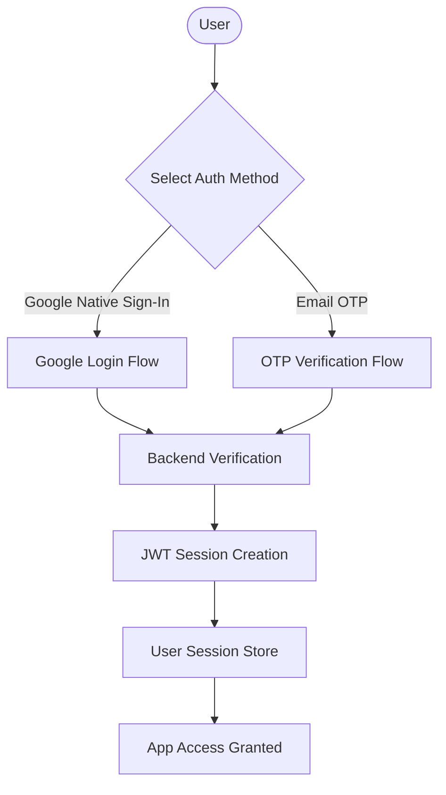
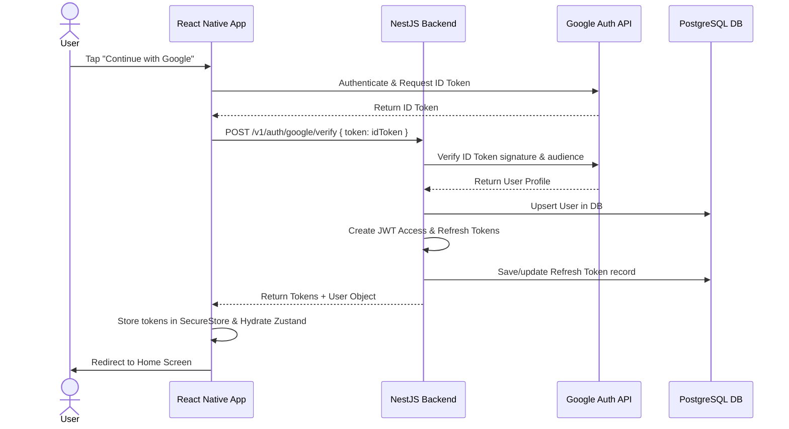
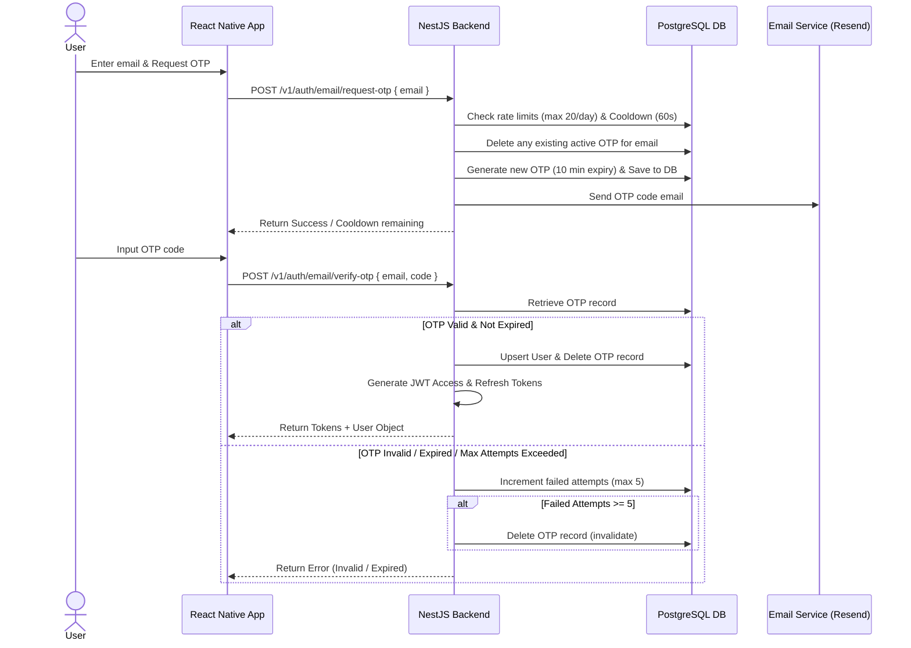
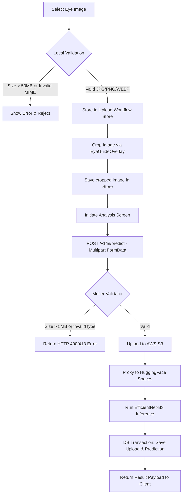
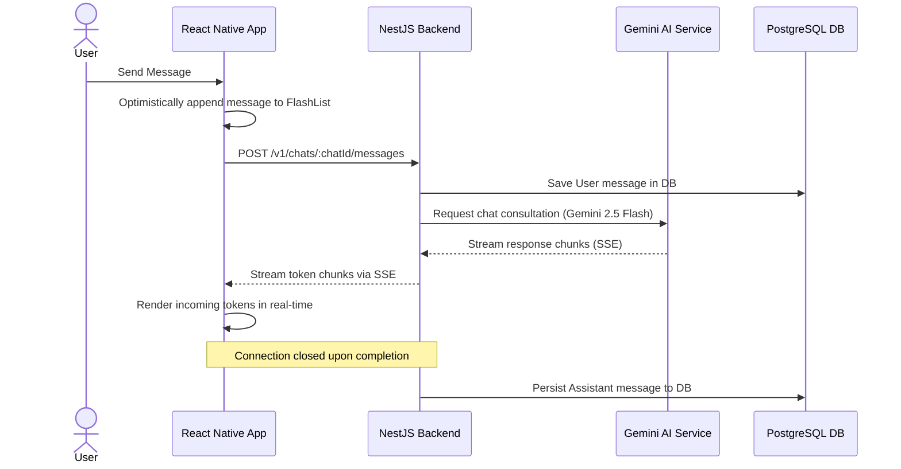
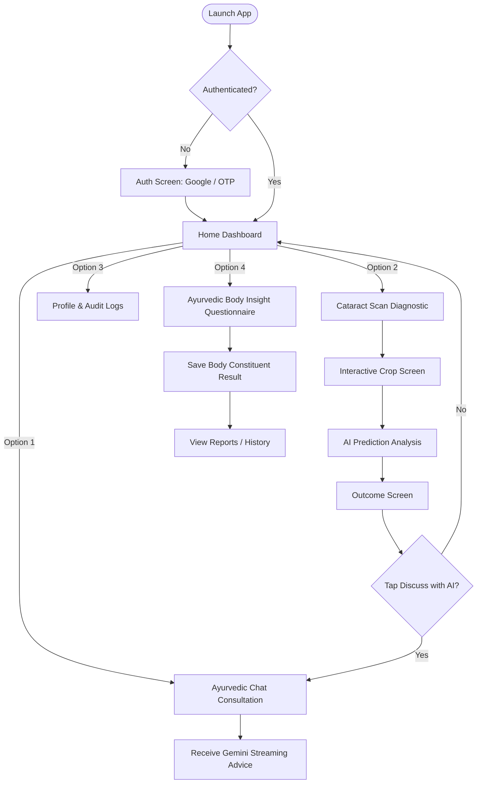
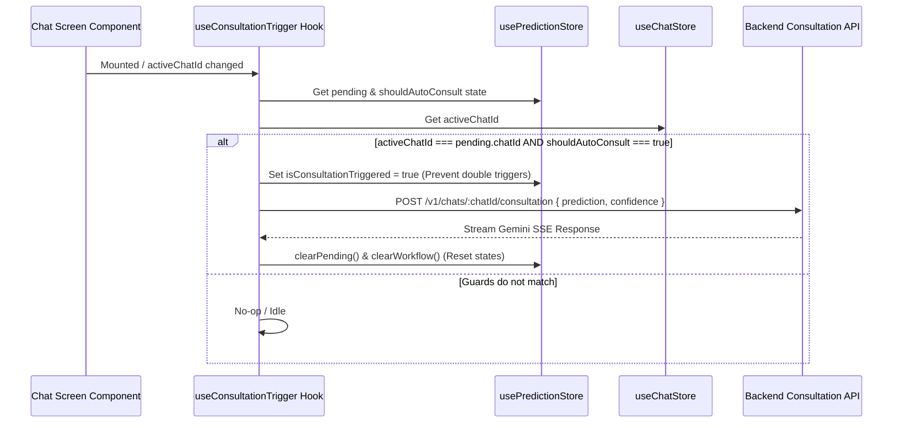
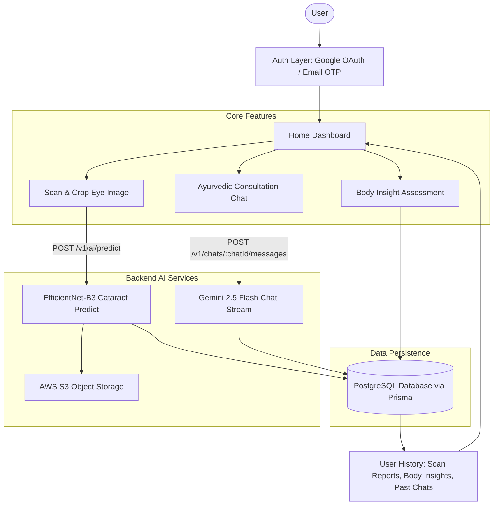

# spandavidya Backend

Production-ready NestJS boilerplate with authentication, RBAC, auditing, structured logging, metrics, and observability.

## 🔥 Features

- **Authentication**: JWT-based access & refresh token flows
- **Authorization**: Role-based access control (`@Roles`, `@Public`)
- **Audit Logging**: Tracks user actions, metadata, and diffs
- **Exception Handling**: Global filters + Prisma error mapper
- **Structured Logging**: Winston + JSON + request context
- **Observability**: Prometheus metrics and `/metrics` endpoint
- **Tracing**: Sentry integration with request tracing
- **Swagger Docs**: Auth flows, response examples, RBAC
- **CI/CD**: GitHub Actions with lint/test/build
- **Dockerized Dev**: API, DB, and pgAdmin containerized
- **Testing**: Unit and E2E setup with DB seed/reset helpers

---

## 🛠 Tech Stack

- **Framework**: NestJS
- **ORM**: Prisma
- **DB**: PostgreSQL
- **Monitoring**: Prometheus + Sentry
- **Security**: Helmet, CORS, Rate-Limit, HPP
- **Testing**: Jest + Supertest

---

## 📦 Deployment

Use Docker Compose or adapt to your preferred platform. Sentry and Prometheus require credentials and/or dashboards.

Backend Requirements:

- NestJS
- TypeScript
- PostgreSQL
- Prisma ORM
- JWT Authentication
- REST APIs
- File upload support
- ML model integration
- Streaming responses
- Chat persistence
- Scalable modular architecture
- Production-grade security
- Docker support
- API validation
- Logging
- Rate limiting
- S3 uploads

Application Flow:
Frontend → NestJS Backend → ML Team API

Important Rules:

- Frontend NEVER communicates directly with AI providers
- Backend handles:
  - ML API communication
  - authentication
  - authorization
  - chat persistence
  - file uploads
  - streaming
  - rate limiting
  - retries
  - logging
  - caching
  - validation

Need:

1. Best modern NestJS architecture (2026 standards)
2. Scalable folder structure
3. Recommended modules
4. Database schema design
5. Prisma schema recommendations
6. JWT auth architecture
7. Refresh token strategy
8. RBAC strategy
9. Streaming response architecture
10. File upload architecture
11. ML service integration architecture
12. API versioning strategy
13. Error handling architecture
14. Logging strategy
15. Validation strategy
16. Docker setup
17. CI/CD recommendations
18. Security best practices
19. Performance optimization
20. Caching strategy
21. Background job strategy
22. Rate limiting strategy
23. WebSocket vs SSE recommendation
24. Production deployment strategy

Required Backend Modules:

- **auth:** Handled via passport-jwt, Native Google Sign-In verification (`POST /auth/google`), and email OTP flow (`POST /auth/email/request-otp` and `POST /auth/email/verify-otp`) with secure session refresh token rotation.
- **users:** User profile CRUD, profile views, and changes.
- **chat:** Combined chat session and message storage module. Manages conversation history construction, rate limit transactions, and token streaming via Server-Sent Events (SSE). Includes sub-services:
  - `ChatHistoryService`: Standardizes prompt context extraction, compacts whitespace, and applies token budget limits.
  - `ChatPersistenceService`: Handles database updates for tokens, completions, and error mapping.
  - `GeminiProviderService`: Manages model configurations and endpoint URL mapping.
- **ai:** Direct multipart image validation, S3 upload coordination, and HuggingFace Spaces EfficientNet-B3 inference pipeline.
- **uploads:** S3 presigned URL generation for general uploads.
- **audit-log:** Append-only log recording user updates, creations, and profile actions. Logs events such as `OTP_REQUESTED`, `USER_REGISTERED`, and `USER_LOGGED_IN` with IP address and user-agent context.
- **health:** Readiness and liveness probes.
- **config:** Dynamic validation and loading of application environment variables.

Also provide:

- anti-patterns to avoid
- bad NestJS practices
- outdated approaches
- common AI backend mistakes
- production scaling advice

Use latest stable versions and modern industry standards only.

# AI Chat Application - NestJS Backend Architecture

**Core Responsibilities:**

- Secure gateway (Authentication & Authorization)
- Chat history persistence
- File upload coordination (S3)
- Rate limiting & cost control
- Streaming LLM responses (SSE)

---

## Scalable Folder Structure

Adopt a **Feature-Module** approach (Domain-Driven Design principles) rather than technical grouping. This ensures maximum scalability and maintainability.

## env example

```
NODE_ENV=development
PORT=8080

# Database
DATABASE_URL="postgresql://postgres:@db.wuaza.supabase.co:5432/postgres"
DIRECT_URL="postgresql://postgres:@db..supabase.co:5432/postgres"

# JWT Configuration
JWT_SECRET=jwt_secre
JWT_EXPIRES_IN=60m
JWT_REFRESH_SECRET=jwt_refresh_sec
JWT_REFRESH_EXPIRES_IN=7d

# Postgres Configuration
POSTGRES_USER=postgres
POSTGRES_PASSWORD=postgres
POSTGRES_DB=spandavidya

# ML Gateway (Hugging Face Cataract Detection)
HUGGINGFACE_API_URL=https://sameer2210-cataractaiml.hf.space/predict
ML_GATEWAY_TIMEOUT_MS=60000
ML_GATEWAY_MAX_RETRIES=0

# Google Gemini AI (for Chat module — Ayurvedic consultation streaming)
GOOGLE_API_KEY=A
GOOGLE_GEMINI_MODEL=gemini-2.5-flash

AWS_ACCESS_KEY_ID=AKIAS
AWS_SECRET_ACCESS_KEY=jXjhPpTO
AWS_REGION=ap-so
AWS_S3_BUCKET_NAME=sameer

# Google OAuth
GOOGLE_WEB_CLIENT_ID=6132179582
GOOGLE_ANDROID_CLIENT_ID=613217958226-.com
GOOGLE_IOS_CLIENT_ID=613217googleusercontent.com
```

## Authentication Architecture (Google & OTP Auth)

We will use **JWT with a Refresh Token Rotation strategy** to provide both security and seamless UX on mobile. Use latest stable versions and modern industry standards only.

### Authentication Flow Diagram



### Google Login Flow Diagram



### OTP Verification Flow Diagram



### Email OTP Rules
1. **Deduplication:** Generating a new OTP deletes any active OTP records associated with that email.
2. **Expirations & Attempts:** OTPs are stored with a 10-minute expiry time. Verification allows a maximum of 5 failed attempts before the OTP is deleted/invalidated.
3. **Daily Rate Limit:** Maximum 20 OTP requests per email per day.
4. **Cooldown Rate Limit:** Must wait 60 seconds between request submissions.
5. **Auditing:** Authenticated and guest events log `OTP_REQUESTED`, `USER_REGISTERED` (for signups), and `USER_LOGGED_IN` to the audit log.

# Authentication Types

Mobile auth and web auth are isolated.

1. Mobile Native Google Authentication Used for: Android & iOS
   Library: @react-native-google-signin/google-signin
   This is the PRIMARY auth flow.

2. Web Authentication
   Separate web flow exists for: Expo web and browser environments

## 5. File Upload Architecture

We partition S3 file uploads by context to ensure optimal performance and security:

1. **General Uploads (Zero-Backend Bottleneck):**
   - Frontend calls `POST /uploads/presigned-url` with file metadata (size, type).
   - Backend validates request and generates a temporary S3 Presigned URL.
   - Frontend uploads the file directly to S3.
   
2. **AI Scan Prediction Images (Gateway Direct Upload):**
   - Frontend sends the cropped image as multipart `FormData` directly to NestJS via `POST /v1/ai/predict`.
   - Backend Multer interceptor checks constraints (size ≤ 5 MB, type ∈ JPEG/PNG/WEBP, dimensions ≤ 4096 px).
   - Backend uploads the image buffer to AWS S3, forwards to Hugging Face, saves prediction database logs, and returns the prediction result.

---

## 6. Server-Sent Events (SSE) vs WebSockets

**Recommendation: SSE (Server-Sent Events)**
For AI text generation, you strictly stream data from Server -> Client. WebSockets add unnecessary overhead (stateful connections, heavy handshakes). SSE operates over standard HTTP/2, automatically handles reconnects, and works natively with React Native.

---

## 7. Recommended Modules & Packages

Run this installation script for a production-ready setup:

```
# Database
npm install @prisma/client
npm install -D prisma

npm run prisma:restart
in backend
npx prisma db push --force-reset
npx prisma generate
npx prisma studio

# AWS S3 & Logging
npm install @aws-sdk/client-s3 @aws-sdk/s3-request-presigner

# Background Jobs & Caching (Optional but recommended)
npm install @nestjs/bullmq bullmq @nestjs/cache-manager cache-manager cache-manager-redis-yet
```

---

## 8. API & System Strategies

- **API Versioning:** Use NestJS Global URI Versioning (`app.enableVersioning({ type: VersioningType.URI })`). All routes begin with `/v1`.
- **Validation:** Use `class-validator` globally. Enable `whitelist: true` and `forbidNonWhitelisted: true` in the `ValidationPipe` to strip malicious payload injections.
- **Logging:** Use `nestjs-pino`. It provides zero-allocation JSON logging which integrates perfectly with Datadog/AWS CloudWatch and allows tracing via correlation IDs.
- **Rate Limiting:** Use `@nestjs/throttler` (backed by Redis via `cache-manager-redis-yet`). Establish strict limits on the `/ai/generate` endpoint to prevent billing attacks.

---

## Cataract Prediction & Upload Pipeline

### Image Upload Flow Diagram



### Scan Analysis Flow Diagram

#### FLOW A: Home-Origin Scan
```mermaid
graph TD
    Home[Home Screen] ──► Upload[Scan Upload]
    Upload ──► Crop[Crop Screen]
    Crop ──► Analysis[Analysis Screen]
    Analysis ──►|POST /v1/ai/predict| Result[Result Screen]
    Result ──►|Click "Discuss With AI"| Chat[Chat Screen]
    Chat ──►|Auto Consultation Triggered| Consult[POST /v1/chats/:chatId/consultation]
    Consult ──► Gemini[Gemini SSE Response]
```

**Back Navigation Flow A:**
* **Result Screen / Error Result Screen:** Header back and swipe gestures are disabled. Android physical back button replaces route with `/(tabs)` (Home tab).
* **Crop Screen:** Back arrow/cancel calls `router.back()` to return to `Scan Upload`.
* **Scan Upload:** Back returns to `Home Tab`.

---

#### FLOW B: Chat-Origin Scan
```mermaid
graph TD
    Chat[Chat Screen] ──►|Attach Image| Crop[Crop Screen]
    Crop ──► Analysis[Analysis Screen]
    Analysis ──►|POST /v1/ai/predict with chatId| Return[Return to Same Chat Screen]
    Return ──►|Auto Consultation Triggered| Consult[POST /v1/chats/:chatId/consultation]
    Consult ──► Gemini[Gemini SSE Response]
```

**Back Navigation Flow B:**
* **Crop Screen:** Cancel/back arrow calls `router.back()` to return to the active `Chat Screen`.
* **Result Screen (Error):** Android physical back replaces route with `/(tabs)` (Home tab).


---

### Backend Chat Resolution Rules

To prevent data corruption, message leaks, and state hijacking, the `/v1/ai/predict` endpoint strictly implements the following chat resolution logic:

1. **Explicit `chatId` Provided:**
   - The backend checks if the chat exists and is owned by the authenticated `userId`.
   - If ownership is verified, the prediction and S3 file are linked to this chat.
   - If not found or owned by a different user, the request immediately fails with `HTTP 404 Target chat session not found`.

2. **`chatId` Omitted:**
   - The backend explicitly creates a new chat session titled "AI Health Consultation" for the user.
   - The prediction and S3 file are linked to the newly created chat, and the new `chatId` is returned to the client.

3. **Strict Prohibitions (No Fallbacks):**
   - **No Newest Chat Fallback:** The backend **never** falls back to finding the user's latest or most recent chat session.
   - **No Silent Assignment:** Scans must never be silently attached to any arbitrary chat.

---

### Failure Case Actions & Codes

| Failure | Response / Code | Action |
| :--- | :--- | :--- |
| File > 50 MB | Rejected locally | Frontend throws: "Image size must be less than 50 MB" |
| Invalid Type | Rejected locally | Frontend throws: "Only JPG, PNG, WEBP allowed" |
| File > 5 MB | `HTTP 413 Payload Too Large` | Multer rejects upload |
| Invalid MIME | `HTTP 400 Bad Request` | Interceptor rejects request |
| S3 Upload Fail | `HTTP 500 Internal Server Error` | Logs to Pino/Sentry, stops flow |
| ML Timeout | `HTTP 503 AI service temporarily busy` | Retries exhausted |
| ML Unavailable | `HTTP 503 AI service temporarily unavailable` | Service offline after retries |
| Unauthorized | `HTTP 401 Unauthorized` | JWT authorization required |

# Cataract AI ML Service----------------------------------------------------------------------

## Overview

Cataract AI ML Service is a FastAPI-based machine learning inference microservice used by the SpandhVidhya healthcare platform.

The service receives an eye image, performs preprocessing, runs inference using an EfficientNet-B3 model, and returns cataract-related predictions.

This service is deployed independently on Hugging Face Spaces and is consumed by the main NestJS backend.

---

# Production URL

Base URL:https://sameer2210-cataractaiml.hf.space

Swagger Documentation:https://sameer2210-cataractaiml.hf.space/docs

---

# Purpose

This service exists only for ML inference.

Responsibilities:

- Receive eye image
- Preprocess image
- Run EfficientNet-B3 model
- Generate prediction
- Return confidence score

Non-responsibilities:

- Authentication
- Authorization
- User management
- Patient management
- Database persistence
- Business logic
- Medical record storage

These responsibilities belong to the NestJS backend.

---

# Architecture

React Native App
↓
NestJS Backend
↓
ML Gateway Service
↓
Hugging Face ML API
↓
EfficientNet-B3 Model
↓
Prediction Response

---

# Model Information

Model Type: EfficientNet-B3
Framework: pyTorch
Deployment: FastAPI + Docker + Hugging Face Spaces
Inference Device: CPU
Model File: weights/best_efficientnet_b3_cataract.pth

---

# Prediction Classes

The system processes eye scan classification enums at two layers:

### 1. ML Raw Classes (Hugging Face Model Output)
- `Normal` (No cataract)
- `Immature` (Early cataract)
- `Mature` (Advanced cataract)
- `IOL_Inserted` (Post-surgery artificial lens)

### 2. Backend Mapped & Validated Enums (API `/consultation` validator)
The database persistence layer and the consultation creation endpoint expect and validate the following enums:
- `No_Cataract`
- `Immature_Cataract`
- `Mature_Cataract`
- `IOL_Inserted`

Any custom client consultations or manual triggers must adhere strictly to the validated enums list to pass schema validation constraints.

---

# API Endpoints

## Health Endpoint

GET /
Response:

{
"message": "Cataract AI Running"
}

Purpose:
Used for health checks and deployment verification.

---

## Prediction Endpoint

POST /predict
Content-Type: multipart/form-data
Field: file

Example Request:
file=<image>

Example Response:
{
"prediction": "IOL_Inserted",
"confidence": 0.92
}

Response Fields:
prediction:
Predicted class label.

confidence:
Probability score returned by the model.

Range:
0.0 to 1.0

Prediction Output:

- Predicted Eye Condition
- AI Confidence Score

Confidence Score Meaning:
The confidence score represents how strongly the AI model believes the uploaded image matches a predicted eye condition.

Example:
54% confidence means the model found moderate similarity with the predicted class.

Medical Note:
This AI system is designed for screening assistance and educational support only. Final diagnosis and treatment decisions should always be confirmed by a qualified ophthalmologist.

---

# Input Requirements

Accepted Formats:

- JPG
- JPEG
- PNG

Recommended:

- High-resolution eye image
- Proper lighting
- Eye centered in frame
- Minimal blur

Maximum Image Size:

Determined by FastAPI upload limits.

---

1. Lens Detection

2. Contrast Enhancement

Ye medical imaging me commonly use hota.

Model Workflow:
Eye Image
→ Lens Detection - Hough Circle Detection -use ho raha eye lens isolate karne ke liye.
→ Image Enhancement - CLAHE preprocessing - use ho raha visibility improve karne ke liye.
→ AI Analysis
→ Cataract Classification
→ Confidence Scoring

# Inference Pipeline

Step 1 Receive uploaded image.
Step 2 Load image using Pillow.
Step 3 Convert image to RGB.
Step 4 Resize image to model input size.
Step 5 Apply torchvision transforms.
Step 6 Generate tensor.
Step 7 Run EfficientNet-B3 inference.
Step 8 Apply Softmax.
Step 9 Extract highest probability class.
Step 10 Return JSON response.

---

# Output Schema

{
"prediction": "string",
"confidence": "float"
}

Example:

{
"prediction": "Immature",
"confidence": 0.87
}

---

# Current Limitations

1. CPU Inference

Inference runs on CPU.

No GPU acceleration currently.

---

2. No Authentication

API is publicly accessible.

Must be protected through backend gateway.

---

3. No Rate Limiting

Requests are not rate limited.

Production backend should enforce limits.

---

4. No Prediction Storage

Predictions are not saved.

Persistence must be handled by NestJS.

---

5. No Patient Context

Model only receives image input.

No patient metadata is used.

---

6. No Explainability

Grad-CAM or heatmap visualization is not implemented.

---

# Integration Contract

This service should never be called directly from React Native.

Correct Architecture:

React Native
↓
NestJS Backend
↓
ML Gateway Service
↓
This API

Reason:

- Security
- Retry handling
- Logging
- Auditing
- Persistence
- Future provider switching

---

# Environment

Python: 3.11

Core Dependencies:

- FastAPI
- Uvicorn
- Torch
- TorchVision
- Pillow
- NumPy

---

# Folder Structure

cataract-ai/

app/
├── main.py
├── predictor.py
└── preprocessing.py

weights/
└── best_efficientnet_b3_cataract.pth

requirements.txt
Dockerfile
README.md

---

# Deployment

Platform:Hugging Face Spaces
Deployment Type: Docker Space
Container Port: 7860
Server: Uvicorn
Startup Command: python -m uvicorn app.main:app --host 0.0.0.0 --port 7860

---

# Future Improvements

Planned Enhancements:

- CLAHE preprocessing
- Hough Circle Detection
- Lens masking
- Grad-CAM visualization
- GPU inference
- Model versioning
- Prediction auditing
- Monitoring
- Rate limiting
- Authentication
- Multi-model support

---

# Important Note For Future AI Agents

This repository houses the NestJS backend API. The ML inference logic is hosted in a separate stateless microservice (FastAPI + EfficientNet-B3 on HuggingFace Spaces). All business logic, user sessions, chat persistence, S3 uploads, and audits are strictly implemented here.

---

## 🧪 Testing Architecture

We implement a complete testing pyramid. The environment automatically isolates integration/E2E databases using the `TEST_DATABASE_URL` environment variable.

### Running Backend Tests

Ensure `TEST_DATABASE_URL` is configured in your shell environment:

```bash
# Push the schema to the test database
npx cross-env DATABASE_URL=YOUR_TEST_DB_URL npx prisma db push --skip-generate

# Run Unit tests
npm run test:unit

# Run Integration tests (verifies database persistence)
npm run test:integration

# Run E2E tests (verifies NestJS controllers via Supertest)
npm run test:e2e

# Run all test suites
npm run test:all
```

---

## Diagrams

### Chat Flow Diagram



### User Journey Flow Diagram



### AI Consultation Flow Diagram



### Navigation Flow Diagram

```mermaid
graph TD
    index.tsx[app/index.tsx <br/> Landing Screen] -->|Unauthenticated| login[app/login.tsx <br/> Shared AuthScreen]
    index.tsx -->|Authenticated| tabs[app/(tabs)/_layout.tsx <br/> Tab Navigator]
    
    subgraph Tabs [Tabs Group]
        tabs --> tabIndex[app/(tabs)/index.tsx <br/> Home Dashboard]
        tabs --> tabChat[app/(tabs)/chat.tsx <br/> Chat Consultation]
        tabs --> tabReports[app/(tabs)/reports.tsx <br/> Reports History]
        tabs --> tabExplore[app/(tabs)/explore.tsx <br/> Architecture Status]
        tabs --> tabProfile[app/(tabs)/profile.tsx <br/> Profile & Settings]
    end
    
    tabIndex -->|Start Scan| scanUpload[app/scan-upload.tsx]
    tabChat -->|Attach Scan| eyeCrop[app/eye-crop.tsx]
    
    scanUpload --> eyeCrop
    eyeCrop --> scanAnalysis[app/scan-analysis.tsx]
    scanAnalysis --> scanResult[app/scan-result.tsx]
    
    tabIndex --> bodyInsight[app/body-insight.tsx]
    tabIndex --> dataCollection[app/data-collection.tsx]
    
    scanResult -->|Discuss with AI| tabChat
```

### Application End-to-End Flow Diagram



