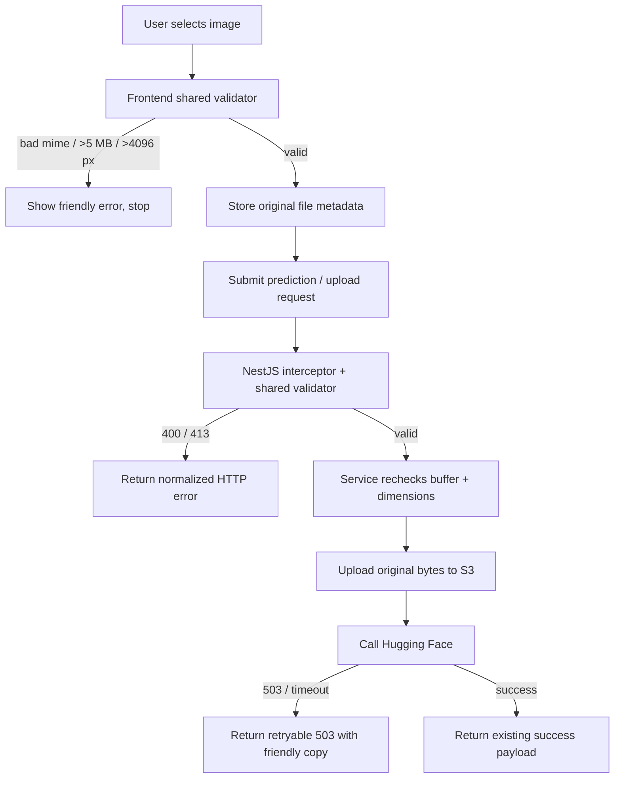

# SpandaVidya Frontend

I am building a production-grade AI chat application similar to ChatGPT.

Expo-based React Native client for the SpandaVidya application. The current app combines:
The frontend is written in

- React Native
- Expo CLI
- Expo Router
- TypeScript
- NativeWind
- Zustand
- TanStack React Query
- Axios
- React Hook Form
- Zod
- FlashList
- Reanimated
- Bottom Sheet
- Secure Store
- Image Picker
- Document Picker

Project Requirements:

- AI chat application
- User can send:
  - text prompts
  - images
  - documents/files
- ML model processing is handled by a separate backend/ML team
- Frontend only communicates with backend APIs
- Real-time streaming responses
- Chat history
- Markdown/code rendering
- Modern responsive UI
- Android + iOS support
- Scalable architecture
- Production-ready codebase
- TypeScript mandatory
- Authentication UI
- Chat UI
- Streaming response rendering
- File/image uploads
- Markdown rendering
- Optimistic updates
- Pagination
- State management
- API integration
- Mobile UX
- Animations
- Dark/light theme

# follow

1. Best modern Expo project setup (2026 standards)
2. Best folder structure
3. Recommended packages with reasons
4. Exact package installation commands
5. Scalable frontend architecture
6. Best practices for AI chat apps
7. iOS compatibility-safe package recommendations
8. Clean API layer architecture
9. Feature-based architecture
10. Performance optimization tips
11. Recommended state management approach
12. Streaming response implementation approach
13. Modern reusable UI component strategy
14. Environment variable setup
15. Error handling architecture
16. Recommended naming conventions
17. Production-grade frontend patterns
    Use latest stable versions and modern industry standards only.

### Navigation and screens

- Public home screen at `app/index.tsx`
- Login and signup routes that reuse a shared animated `AuthScreen`
- Tab navigator with:
  - chat screen in `app/(tabs)/index.tsx`
  - architecture/status screen in `app/(tabs)/explore.tsx`
- Standalone ML data collection route
- Standalone Body Insight assessment route

### Authentication and session handling

### Chat UI and streaming client scaffolding

- Message list rendered with `FlashList`
- Markdown rendering for assistant replies
- Optimistic message insertion while sending
- Infinite-query hook for message pagination
- Attachment pickers for images and documents
- SSE-style stream parser for token events

### Data collection and assessment flows

- `BodyInsightForm`
  - renders a local questionnaire and progress count

### Client infrastructure

- Centralized API client and typed application errors
- React Query lifecycle integration with app foreground/background state and network status
- Theme-aware root layout using React Navigation themes
- Reanimated, Gesture Handler, Bottom Sheet provider, and keyboard controller are configured for richer mobile UX

## Tech Stack

- Expo SDK 54
- React Native 0.81
- React 19
- TypeScript
- Expo Router
- NativeWind / Tailwind CSS
- Zustand
- TanStack React Query
- Axios
- React Hook Form
- Zod
- FlashList
- React Native Markdown Display
- Expo Image Picker
- Expo Document Picker
- React Native Reanimated
- Gorhom Bottom Sheet

## Folder Structure

```text
frontend/
|-- app/                         # Expo Router screens and route groups
|   |-- (tabs)/                  # Tab navigator screens
|   |-- index.tsx                # Public landing screen
|   |-- login.tsx                # Login route
|   |-- signup.tsx               # Signup route
|   |-- data-collection.tsx      # ML data collection route
|   |-- eye-crop.tsx             # Standalone Crop Screen route
|   `-- body-insight.tsx         # Questionnaire route
|-- assets/                      # App icons and splash assets
|-- src/
|   |-- components/              # Reusable UI and domain components
|   |-- features/
|   |   |-- auth/                # Auth API, types, and session store
|   |   |-- chat/                # Chat API, hooks, UI, and stream parsing
|   |   `-- upload/              # Image validation, cropping screens, instructions, & store
|   |-- providers/               # App-wide providers
|   |-- shared/                  # API client, env, auth storage, errors
|   |-- services/                # Thin service re-export layer
|   |-- hooks/                   # Theme helpers
|   `-- theme/                   # Theme exports
|-- app.json                     # Expo configuration
|-- package.json                 # Scripts and dependencies
`-- tailwind.config.js           # NativeWind configuration
```

## Important APIs and Services

| Area                 | Current implementation                               |
| -------------------- | ---------------------------------------------------- |
| Auth API             | `src/features/auth/api/auth-api.ts`                  |
| Session store        | `src/features/auth/store/session-store.ts`           |
| Secure token storage | `src/shared/auth/token-storage.ts`                   |
| Shared HTTP client   | `src/shared/api/http-client.ts`                      |
| Query client         | `src/shared/api/query-client.ts`                     |
| Chat API contract    | `src/features/chat/api/chat-api.ts`                  |
| Chat stream parser   | `src/features/chat/streaming/parse-stream-chunks.ts` |
| Upload workflow hook | `src/features/chat/hooks/use-chat-image-workflow.ts` |
| Upload workflow store| `src/features/upload/store/upload-workflow-store.ts` |
| Consultation trigger | `src/features/chat/hooks/use-consultation-trigger.ts`|

## Environment Variables

Create `frontend/.env` with the values required by the current code:

```bash
EXPO_PUBLIC_API_URL=http://localhost:8080
EXPO_PUBLIC_GOOGLE_WEB_CLIENT_ID=your-web-client-id
EXPO_PUBLIC_GOOGLE_IOS_CLIENT_ID=your-ios-client-id
EXPO_PUBLIC_GOOGLE_ANDROID_CLIENT_ID=your-android-client-id
```



## Theme System Design & Guidelines

SpandaVidya leverages a dynamic, context-driven theme architecture. The UI is built to dynamically switch between **Light**, **Dark**, and **System** settings.

### 1. Theme Flow Diagram

```
                  ┌────────────────────────┐
                  │      SecureStore       │
                  └───────────┬────────────┘
                              │ hydrate on launch (once)
                              ▼
┌──────────────┐  ┌────────────────────────┐  ┌────────────────────────┐
│  OS Settings ├─►│     ThemeProvider      ├─►│      ThemeContext      │
└──────────────┘  └───────────┬────────────┘  └───────────┬────────────┘
                              │                           │
                              │ provides Navigation Theme │ exposes hook
                              ▼                           ▼
                  ┌────────────────────────┐  ┌────────────────────────┐
                  │ React Navigation Shell │  │      useTheme()        │
                  └────────────────────────┘  └────────────────────────┘
```

### 2. File Directory (`src/theme/`)

- [types.ts](file:///c:/Users/Sam/Desktop/SpandaVidyaAi-app/frontend/src/theme/types.ts) — Declarations for `ColorTheme` keys and providers.
- [colors.ts](file:///c:/Users/Sam/Desktop/SpandaVidyaAi-app/frontend/src/theme/colors.ts) — Theme palettes (`lightColors` and `darkColors`).
- [themes.ts](file:///c:/Users/Sam/Desktop/SpandaVidyaAi-app/frontend/src/theme/themes.ts) — Base spacing (`xs`, `sm`, `md`, `lg`, `xl`) and border-radii (`md`, `lg`, `xl`, `full`).
- [navigation-theme.ts](file:///c:/Users/Sam/Desktop/SpandaVidyaAi-app/frontend/src/theme/navigation-theme.ts) — Bridges the application design system with React Navigation stack wrapper configurations.
- [storage.ts](file:///c:/Users/Sam/Desktop/SpandaVidyaAi-app/frontend/src/theme/storage.ts) — Persists user selection in `SecureStore` (native app) or `localStorage` (web build).

### 3. Developer Implementation Rules

To maintain high visual quality and support both theme types, developers and AI agents must follow these guidelines:

#### A. Accessing Theme Context
Do not import colors directly from `colors.ts`. Instead, always access theme properties through the context hook:
```typescript
import { useTheme } from '@/theme';

const { theme, isDark, themeMode, setThemeMode } = useTheme();

// Use themed attributes:
// theme.colors.background.base
// theme.colors.accent.primary
// theme.colors.border.subtle
```

#### B. Extending Theme Tokens (Step-by-Step)
If a specific component requires a brand-new semantic color not present in the design system:
1. Open [src/theme/types.ts](file:///c:/Users/Sam/Desktop/SpandaVidyaAi-app/frontend/src/theme/types.ts) and add the property to the `ColorTheme` interface:
   ```typescript
   export interface ColorTheme {
     // ... existing tokens
     myNewComponentColor: string;
   }
   ```
2. Open [src/theme/colors.ts](file:///c:/Users/Sam/Desktop/SpandaVidyaAi-app/frontend/src/theme/colors.ts) and define its values in both palettes:
   ```typescript
   export const darkColors: ColorTheme = {
     // ...
     myNewComponentColor: 'rgba(255, 255, 255, 0.08)',
   };

   export const lightColors: ColorTheme = {
     // ...
     myNewComponentColor: 'rgba(140, 107, 62, 0.05)',
   };
   ```

#### C. Absolute Prohibition of Hardcoded Colors
- **NO Inline Hex Codes**: Do not use `#FFFFFF`, `#000000`, etc. directly inside stylesheets or component style parameters.
- **NO Raw rgba/rgb Strings**: Do not use `rgba(239, 68, 68, 0.15)` or similar hardcoded transparency values.
- **NO Hardcoded Tailwind Colors**: Do not use Tailwind/NativeWind arbitrary color classes (e.g. `bg-[#1A2A43]` or `text-[#F5FAFF]`).
- All active or inactive states, boundaries, and highlights must resolve from `theme.colors`.

#### D. Built-in Theme Elements
Use custom wrappers instead of vanilla React Native components where possible:
- **Text**: Use `<ThemeText>` (from `components/ui/theme/ThemeText`) which automatically applies the theme's primary text color and fontFamily.
- **Surface**: Use `<ThemeSurface>` (from `components/ui/theme/ThemeSurface`) for cards or panels to automatically resolve base background layering.
- **Divider**: Use `<ThemeDivider>` (from `components/ui/theme/ThemeDivider`) for themed line separators.
- **Badge**: Use `<ThemeBadge>` (from `components/ui/theme/ThemeBadge`) for status badges.

