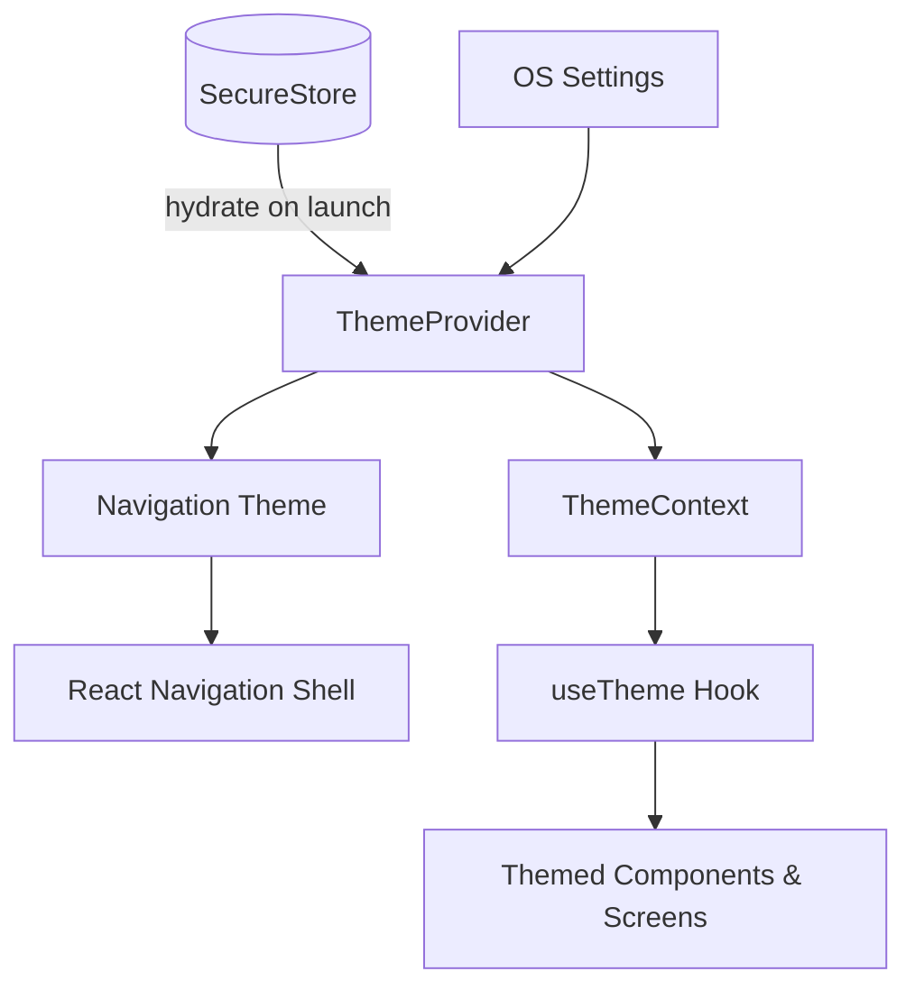
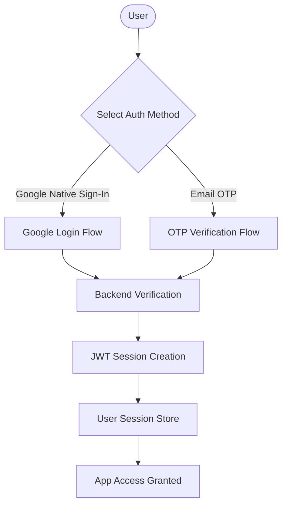
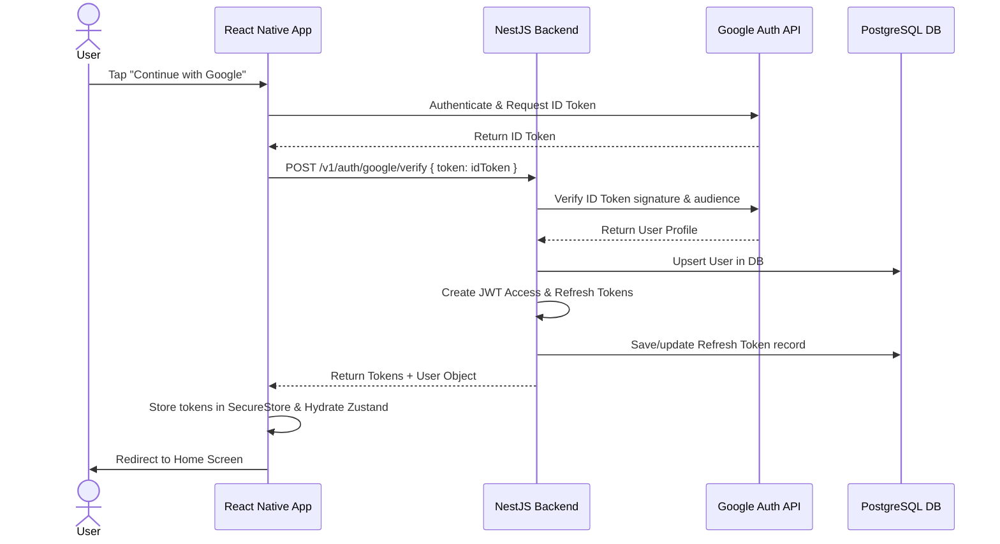
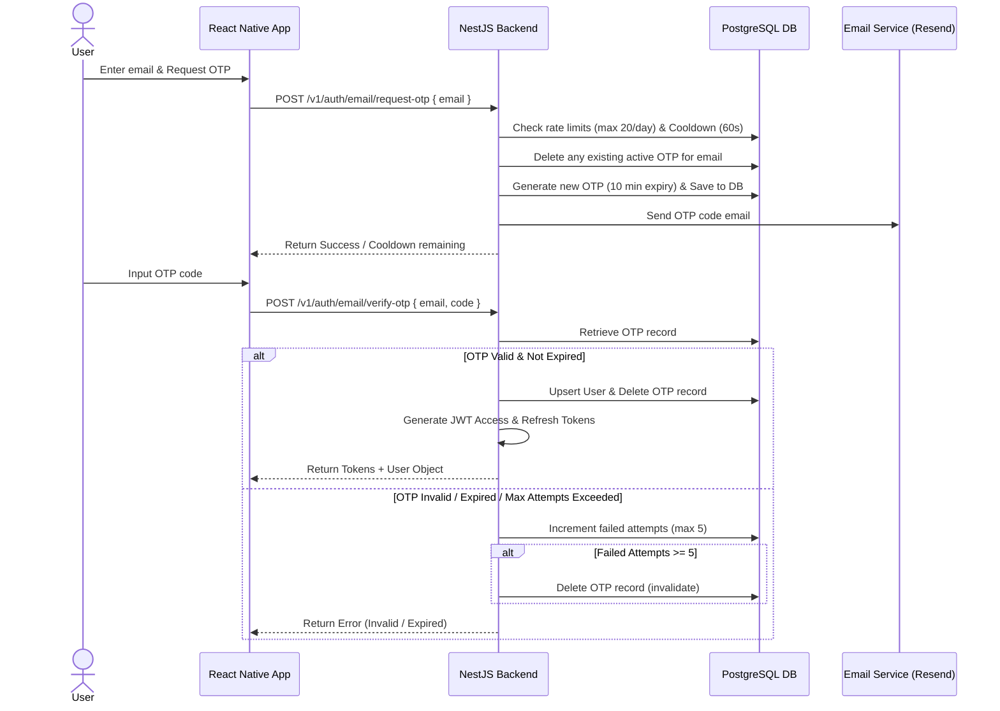
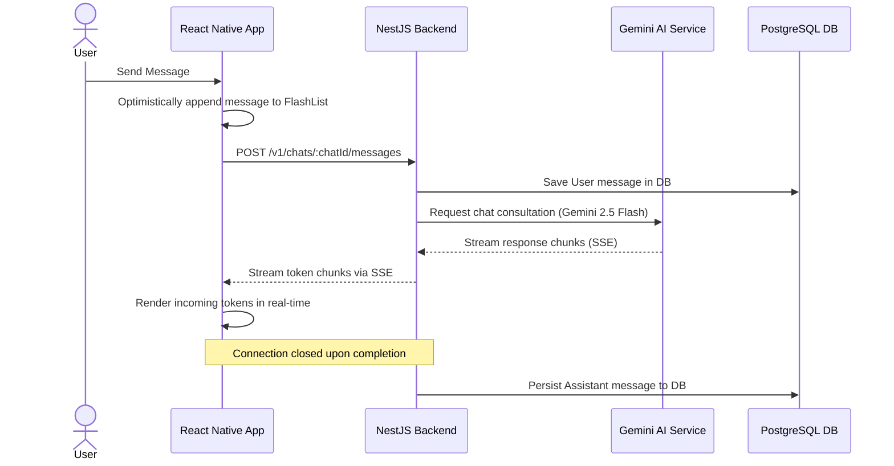
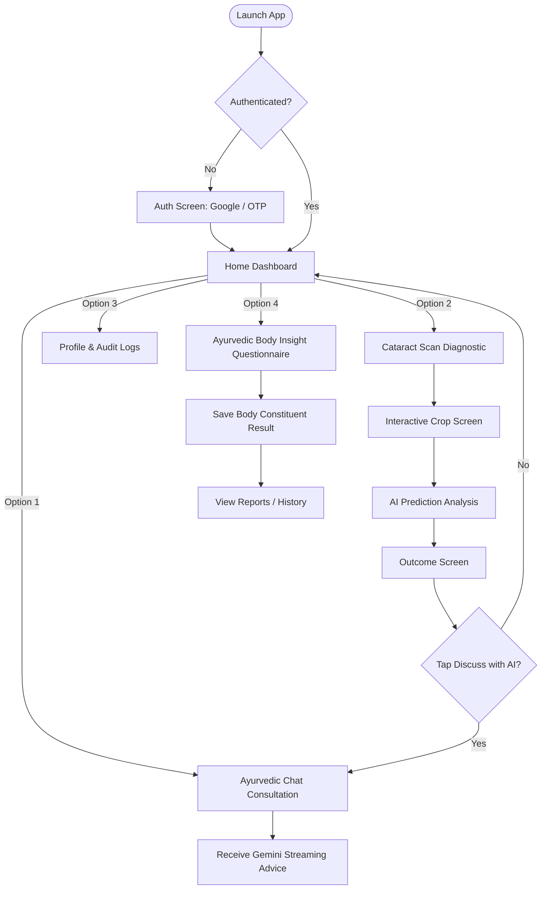
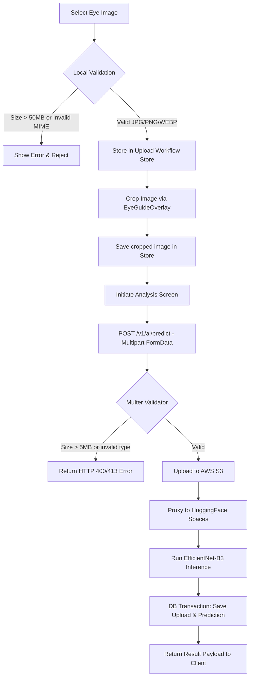
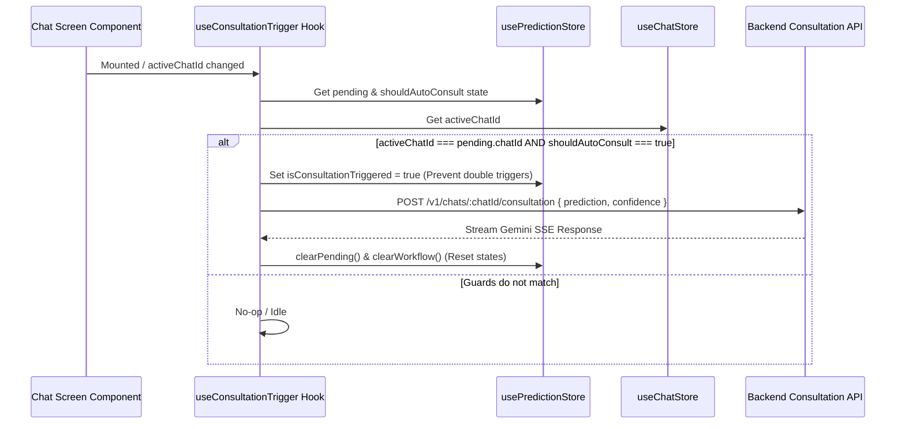
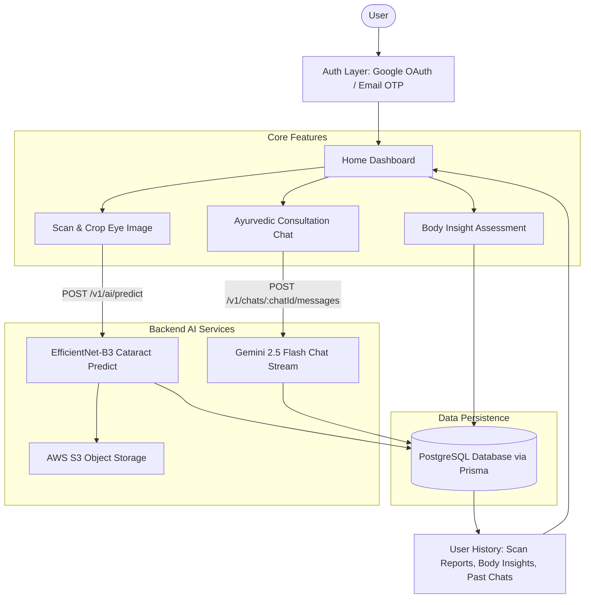

# SpandaVidya Frontend

I am building a production-grade AI chat application similar to ChatGPT.

Expo-based React Native client for the SpandaVidya application. The current app combines:
The frontend is written in

- React Native
- Expo CLI
- Expo Router
- TypeScript
- NativeWind
- Zustand
- TanStack React Query
- Axios
- React Hook Form
- Zod
- FlashList
- Reanimated
- Bottom Sheet
- Secure Store
- Image Picker
- Document Picker

Project Requirements:

- AI chat application
- User can send:
  - text prompts
  - images
  - documents/files
- ML model processing is handled by a separate backend/ML team
- Frontend only communicates with backend APIs
- Real-time streaming responses
- Chat history
- Markdown/code rendering
- Modern responsive UI
- Android + iOS support
- Scalable architecture
- Production-ready codebase
- TypeScript mandatory
- Authentication UI
- Chat UI
- Streaming response rendering
- File/image uploads
- Markdown rendering
- Optimistic updates
- Pagination
- State management
- API integration
- Mobile UX
- Animations
- Dark/light theme

# follow

1. Best modern Expo project setup (2026 standards)
2. Best folder structure
3. Recommended packages with reasons
4. Exact package installation commands
5. Scalable frontend architecture
6. Best practices for AI chat apps
7. iOS compatibility-safe package recommendations
8. Clean API layer architecture
9. Feature-based architecture
10. Performance optimization tips
11. Recommended state management approach
12. Streaming response implementation approach
13. Modern reusable UI component strategy
14. Environment variable setup
15. Error handling architecture
16. Recommended naming conventions
17. Production-grade frontend patterns
    Use latest stable versions and modern industry standards only.

### Navigation and screens

- Public landing/home screen at `app/index.tsx`
- Login and signup routes that reuse a shared animated `AuthScreen`
- Tab navigator (`app/(tabs)/_layout.tsx`) containing:
  - Home Dashboard screen in `app/(tabs)/index.tsx`
  - Consultation Chat screen in `app/(tabs)/chat.tsx`
  - Diagnostic Reports screen in `app/(tabs)/reports.tsx`
  - Profile and Settings screens in `app/(tabs)/profile.tsx`
- Standalone Scan-to-Chat workflow screens:
  - Scan Upload configuration screen in `app/scan-upload.tsx`
  - Image Cropper with overlays in `app/eye-crop.tsx`
  - AI analysis execution screen in `app/scan-analysis.tsx`
  - Prediction/Error outcome display screen in `app/scan-result.tsx`
- Standalone ML data collection route in `app/data-collection.tsx`
- Standalone Body Insight assessment route in `app/body-insight.tsx`

### Authentication and session handling

### Chat UI and streaming client scaffolding

- Message list rendered with `FlashList`
- Markdown rendering for assistant replies
- Optimistic message insertion while sending
- Infinite-query hook for message pagination
- Attachment pickers for images and documents
- SSE-style stream parser for token events

### Data collection and assessment flows

- `BodyInsightForm`
  - renders a local questionnaire and progress count

### Client infrastructure

- Centralized API client and typed application errors
- React Query lifecycle integration with app foreground/background state and network status
- Theme-aware root layout using React Navigation themes
- Reanimated, Gesture Handler, Bottom Sheet provider, and keyboard controller are configured for richer mobile UX

## Tech Stack

- Expo SDK 54
- React Native 0.81
- React 19
- TypeScript
- Expo Router
- NativeWind / Tailwind CSS
- Zustand
- TanStack React Query
- Axios
- React Hook Form
- Zod
- FlashList
- React Native Markdown Display
- Expo Image Picker
- Expo Document Picker
- React Native Reanimated
- Gorhom Bottom Sheet

## Folder Structure

```text
frontend/
|-- app/                         # Expo Router screens and route groups
|   |-- (tabs)/                  # Tab navigator screens (Home, Chat, Reports, Profile)
|   |   |-- index.tsx            # Home Dashboard Screen
|   |   |-- chat.tsx             # Consultation Chat Screen
|   |   |-- explore.tsx          # Status Screen (Architecture Status)
|   |   |-- profile.tsx          # Profile Screen
|   |   `-- reports.tsx          # Diagnostic Reports List Screen
|   |-- index.tsx                # Public landing screen
|   |-- login.tsx                # Login route
|   |-- signup.tsx               # Signup route
|   |-- data-collection.tsx      # ML data collection route
|   |-- scan-upload.tsx          # Scan Upload Screen
|   |-- eye-crop.tsx             # Standalone Crop Screen route
|   |-- scan-analysis.tsx        # AI Analysis Execution Screen
|   |-- scan-result.tsx          # AI Result Display Screen (displays outcome / error)
|   `-- body-insight.tsx         # Questionnaire route
|-- assets/                      # App icons and splash assets
|-- src/
|   |-- components/              # Reusable UI and domain components
|   |-- features/
|   |   |-- auth/                # Auth API, types, and session store
|   |   |-- chat/                # Chat API, hooks, UI, and stream parsing
|   |   `-- upload/              # Image validation, cropping screens, instructions, & store
|   |-- providers/               # App-wide providers
|   |-- shared/                  # API client, env, auth storage, errors
|   |-- services/                # Thin service re-export layer
|   |-- hooks/                   # Theme helpers
|   `-- theme/                   # Theme exports
|-- app.json                     # Expo configuration
|-- package.json                 # Scripts and dependencies
`-- tailwind.config.js           # NativeWind configuration
```

## Important APIs and Services

| Area                 | Current implementation                               |
| -------------------- | ---------------------------------------------------- |
| Auth API             | `src/features/auth/api/auth-api.ts`                  |
| Session store        | `src/features/auth/store/session-store.ts`           |
| Secure token storage | `src/shared/auth/token-storage.ts`                   |
| Shared HTTP client   | `src/shared/api/http-client.ts`                      |
| Query client         | `src/shared/api/query-client.ts`                     |
| Chat API contract    | `src/features/chat/api/chat-api.ts`                  |
| Chat stream parser   | `src/features/chat/streaming/parse-stream-chunks.ts` |
| Upload workflow hook | `src/features/chat/hooks/use-chat-image-workflow.ts` |
| Upload workflow store| `src/features/upload/store/upload-workflow-store.ts` |
| Consultation trigger | `src/features/chat/hooks/use-consultation-trigger.ts`|

## Environment Variables

Create `frontend/.env` with the values required by the current code:

```bash
EXPO_PUBLIC_API_URL=http://localhost:8080/v1
EXPO_PUBLIC_GOOGLE_WEB_CLIENT_ID=your-web-client-id
EXPO_PUBLIC_GOOGLE_IOS_CLIENT_ID=your-ios-client-id
EXPO_PUBLIC_GOOGLE_ANDROID_CLIENT_ID=your-android-client-id
```

### 1. Unified Flow & State Lifecycle Diagram

```mermaid
graph TD
    classDef store fill:#f9f,stroke:#333,stroke-width:2px;
    classDef screen fill:#bbf,stroke:#333,stroke-width:2px;
    classDef process fill:#dfd,stroke:#333,stroke-width:2px;

    %% Elements
    Home[Home Screen]:::screen
    Chat[Chat Screen]:::screen
    Upload[Scan Upload Screen]:::screen
    Crop[Crop Screen]:::screen
    Analysis[Analysis Screen]:::screen
    Result[Result Screen]:::screen
    
    PredictionStore[(usePredictionStore)]:::store
    WorkflowStore[(useUploadWorkflowStore)]:::store
    ChatStore[(useChatStore)]:::store

    %% Flow A: Home Scan
    Home -->|User Taps Scan| Upload
    Upload -->|Select Image & Confirm| Crop
    Crop -->|Confirm Crop| Analysis
    Analysis -->|POST /v1/ai/predict| AnalysisResult{Success?}:::process
    
    AnalysisResult -->|Yes| SetPending[setPending: pending = result, shouldAutoConsult = false]:::process
    SetPending -->|Navigate| Result
    
    Result -->|Discuss Button Clicked| Discuss[Discuss Clicked]:::process
    Discuss -->|activeChatId = pending.chatId| ChatStore
    Discuss -->|shouldAutoConsult = true| PredictionStore
    Discuss -->|Navigate| Chat
    
    AnalysisResult -->|No| SetError[setLastErrorCode = code]:::process
    SetError -->|Navigate| Result

    %% Flow B: Chat Scan
    Chat -->|Attach Image| Crop
    Crop -.->|Confirm Crop| Analysis
    AnalysisResult -.->|Yes (Chat Origin)| SetPendingChat[setPending: pending = result, shouldAutoConsult = true]:::process
    SetPendingChat -->|Navigate / Replace| Chat

    %% Auto Consultation Hook
    Chat -.->|mounts useConsultationTrigger| Trigger[useConsultationTrigger Hook]:::process
    Trigger -->|activeChatId === pending.chatId & shouldAutoConsult === true| StartConsult[POST /v1/chats/:chatId/consultation]:::process
    StartConsult -->|Success| CleanStore[clearPending & clearWorkflow]:::process
```

### 2. State & Hook Design Guidelines

The frontend maintains separation of concerns using three primary stores and hooks to manage the scan-to-chat lifecycles:

1. **`useChatStore`**:
   - Holds `activeChatId` which serves as the single source of truth for chat operations.
   - Prohibited: Changing `activeChatId` in response to background events without user action.

2. **`usePredictionStore`**:
   - Manages state for the current pending cataract prediction.
   - `pending` holds the `{ prediction, confidence, uploadedImageUrl, chatId }` result.
   - `shouldAutoConsult` controls whether the chat screen should invoke a Gemini consultation request automatically on load.
   - `isConsultationTriggered` blocks concurrent executions during rapid render phases.

3. **`useUploadWorkflowStore`**:
   - Manages the active step-by-step progress checklist for the cropping and analysis screen stages.
   - Holds `flowId` (to discard stale background callbacks), `origin` (`'home' | 'chat'`), and `lastErrorCode` for upload error states.

4. **`useConsultationTrigger` Hook**:
   - Mounted in the main Chat Screen component.
   - Verifies the guard condition `activeChatId === pending.chatId` before invoking the consultation API, preventing message leaks or chat hijacking.
   - Calls `clearPending()` and `clearWorkflow()` synchronously on mutation success to clean up global states.

### 3. Back Navigation Rules
* **Result Screen / Error Result Screen:** Android physical back button replaces route with `/(tabs)` (Home tab). Swipe gestures and header back options are disabled to keep screen state clean.
* **Crop Screen:** Cancel/back arrow triggers `router.back()` to return to the correct origin (Scan Upload for Flow A, or the active Chat Screen for Flow B).
* **Analysis Screen:** Back gestures and buttons are disabled during active analysis. If the workflow state is missing required values, the screen redirects back to its origin.

---

## Theme System Design & Guidelines

SpandaVidya leverages a dynamic, context-driven theme architecture. The UI is built to dynamically switch between **Light**, **Dark**, and **System** settings.

### 1. Theme Flow Diagram



### 2. File Directory (`src/theme/`)

- [types.ts](file:///c:/Users/Sam/Desktop/SpandaVidyaAi-app/frontend/src/theme/types.ts) — Declarations for `ColorTheme` keys and providers.
- [colors.ts](file:///c:/Users/Sam/Desktop/SpandaVidyaAi-app/frontend/src/theme/colors.ts) — Theme palettes (`lightColors` and `darkColors`).
- [themes.ts](file:///c:/Users/Sam/Desktop/SpandaVidyaAi-app/frontend/src/theme/themes.ts) — Base spacing (`xs`, `sm`, `md`, `lg`, `xl`) and border-radii (`md`, `lg`, `xl`, `full`).
- [navigation-theme.ts](file:///c:/Users/Sam/Desktop/SpandaVidyaAi-app/frontend/src/theme/navigation-theme.ts) — Bridges the application design system with React Navigation stack wrapper configurations.
- [storage.ts](file:///c:/Users/Sam/Desktop/SpandaVidyaAi-app/frontend/src/theme/storage.ts) — Persists user selection in `SecureStore` (native app) or `localStorage` (web build).

### 3. Developer Implementation Rules

To maintain high visual quality and support both theme types, developers and AI agents must follow these guidelines:

#### A. Accessing Theme Context
Do not import colors directly from `colors.ts`. Instead, always access theme properties through the context hook:
```typescript
import { useTheme } from '@/theme';

const { theme, isDark, themeMode, setThemeMode } = useTheme();

// Use themed attributes:
// theme.colors.background.base
// theme.colors.accent.primary
// theme.colors.border.subtle
```

#### B. Extending Theme Tokens (Step-by-Step)
If a specific component requires a brand-new semantic color not present in the design system:
1. Open [src/theme/types.ts](file:///c:/Users/Sam/Desktop/SpandaVidyaAi-app/frontend/src/theme/types.ts) and add the property to the `ColorTheme` interface:
   ```typescript
   export interface ColorTheme {
     // ... existing tokens
     myNewComponentColor: string;
   }
   ```
2. Open [src/theme/colors.ts](file:///c:/Users/Sam/Desktop/SpandaVidyaAi-app/frontend/src/theme/colors.ts) and define its values in both palettes:
   ```typescript
   export const darkColors: ColorTheme = {
     // ...
     myNewComponentColor: 'rgba(255, 255, 255, 0.08)',
   };

   export const lightColors: ColorTheme = {
     // ...
     myNewComponentColor: 'rgba(140, 107, 62, 0.05)',
   };
   ```

#### C. Absolute Prohibition of Hardcoded Colors
- **NO Inline Hex Codes**: Do not use `#FFFFFF`, `#000000`, etc. directly inside stylesheets or component style parameters.
- **NO Raw rgba/rgb Strings**: Do not use `rgba(239, 68, 68, 0.15)` or similar hardcoded transparency values.
- **NO Hardcoded Tailwind Colors**: Do not use Tailwind/NativeWind arbitrary color classes (e.g. `bg-[#1A2A43]` or `text-[#F5FAFF]`).
- All active or inactive states, boundaries, and highlights must resolve from `theme.colors`.

#### D. Built-in Theme Elements
Use custom wrappers instead of vanilla React Native components where possible:
- **Text**: Use `<ThemeText>` (from `components/ui/theme/ThemeText`) which automatically applies the theme's primary text color and fontFamily.
- **Surface**: Use `<ThemeSurface>` (from `components/ui/theme/ThemeSurface`) for cards or panels to automatically resolve base background layering.
- **Divider**: Use `<ThemeDivider>` (from `components/ui/theme/ThemeDivider`) for themed line separators.
- **Badge**: Use `<ThemeBadge>` (from `components/ui/theme/ThemeBadge`) for status badges.

---

## Diagrams

### Authentication Flow Diagram



### Google Login Flow Diagram



### OTP Verification Flow Diagram



### Chat Flow Diagram



### User Journey Flow Diagram



### Image Upload Flow Diagram



### Scan Analysis Flow Diagram

#### FLOW A: Home-Origin Scan
```mermaid
graph TD
    Home[Home Screen] ──► Upload[Scan Upload]
    Upload ──► Crop[Crop Screen]
    Crop ──► Analysis[Analysis Screen]
    Analysis ──►|POST /v1/ai/predict| Result[Result Screen]
    Result ──►|Click "Discuss With AI"| Chat[Chat Screen]
    Chat ──►|Auto Consultation Triggered| Consult[POST /v1/chats/:chatId/consultation]
    Consult ──► Gemini[Gemini SSE Response]
```

**Back Navigation Flow A:**
* **Result Screen / Error Result Screen:** Header back and swipe gestures are disabled. Android physical back button replaces route with `/(tabs)` (Home tab).
* **Crop Screen:** Back arrow/cancel calls `router.back()` to return to `Scan Upload`.
* **Scan Upload:** Back returns to `Home Tab`.

---

#### FLOW B: Chat-Origin Scan
```mermaid
graph TD
    Chat[Chat Screen] ──►|Attach Image| Crop[Crop Screen]
    Crop ──► Analysis[Analysis Screen]
    Analysis ──►|POST /v1/ai/predict with chatId| Return[Return to Same Chat Screen]
    Return ──►|Auto Consultation Triggered| Consult[POST /v1/chats/:chatId/consultation]
    Consult ──► Gemini[Gemini SSE Response]
```

**Back Navigation Flow B:**
* **Crop Screen:** Cancel/back arrow calls `router.back()` to return to the active `Chat Screen`.
* **Result Screen (Error):** Android physical back replaces route with `/(tabs)` (Home tab).

---

### AI Consultation Flow Diagram



### Navigation Flow Diagram

```mermaid
graph TD
    index.tsx[app/index.tsx <br/> Landing Screen] -->|Unauthenticated| login[app/login.tsx <br/> Shared AuthScreen]
    index.tsx -->|Authenticated| tabs[app/(tabs)/_layout.tsx <br/> Tab Navigator]
    
    subgraph Tabs [Tabs Group]
        tabs --> tabIndex[app/(tabs)/index.tsx <br/> Home Dashboard]
        tabs --> tabChat[app/(tabs)/chat.tsx <br/> Chat Consultation]
        tabs --> tabReports[app/(tabs)/reports.tsx <br/> Reports History]
        tabs --> tabExplore[app/(tabs)/explore.tsx <br/> Architecture Status]
        tabs --> tabProfile[app/(tabs)/profile.tsx <br/> Profile & Settings]
    end
    
    tabIndex -->|Start Scan| scanUpload[app/scan-upload.tsx]
    tabChat -->|Attach Scan| eyeCrop[app/eye-crop.tsx]
    
    scanUpload --> eyeCrop
    eyeCrop --> scanAnalysis[app/scan-analysis.tsx]
    scanAnalysis --> scanResult[app/scan-result.tsx]
    
    tabIndex --> bodyInsight[app/body-insight.tsx]
    tabIndex --> dataCollection[app/data-collection.tsx]
    
    scanResult -->|Discuss with AI| tabChat
```

### Application End-to-End Flow Diagram




